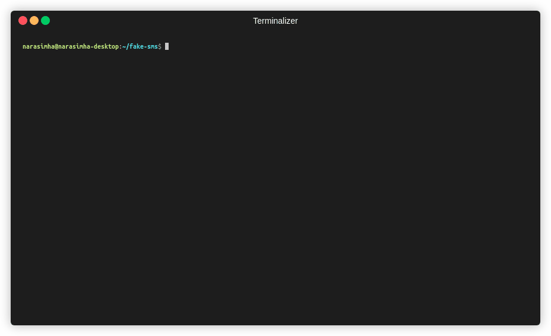
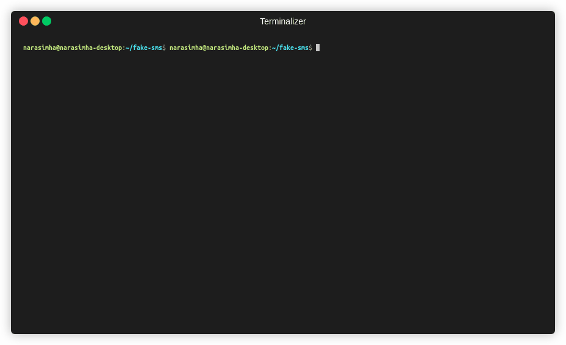

## Fake-SMS
A simple command line tool using which you can skip phone number based SMS verification by using a temporary phone number that acts like a proxy.

**Note-1: This is just an experimental tool, do not use this in any banking transactions. Unethical use of this tool is strictly not encouraged."**

**Note-2: The tool uses upmasked, A Eurpoean service provider, data will be stored on their servers, make sure you agree to EU Data governance laws and GDPR. I recommend you not to use this for any personal transaction which reveals your identity.** 

### Features:
* Written in Go-1.15 (with modules support enabled)
* Provides an interactive CLI, which is easier to use.
* Provides a local file based DB to save and manage a list of fake phone numbers to help you remember and reuse.
* Unofficial client of [upmasked](https://upmasked.com)

### Requirements:
* Go programming language - 1.15+

### To build:
The build process is simple, it is just like building any other Go module. Follow the steps below:
```
export GOBIN=$PWD/bin
go install
```
This will build the binary and place it in `bin/`.
You can also consider using the pre-built binary which is available under `bin/`

#### Steps to use:
1. Register a number in local DB:
You can register a number by selecting one of the available numbers as shown below.



2. Get the messages from any registered number:
You can select a number which was saved in step-1 and view its messages as a list. The tool will also save the dump as json in the format `${PWD}/selected-phone-number.json`. As shown below:



3. Optionally, you can choose to delete the rembered numbers or list them.

#### Acknowledgements
The similar tool is also available in pure shell script. [Check this out.](https://github.com/sdushantha/tmpsms)

#### Contributing
The tool is very simple and I don't think there is any major feature missing. But I would welcome any kind of suggestion, enhancements or a bug-fix from the community. Please open an issue to discuss or directly make a PR!!
